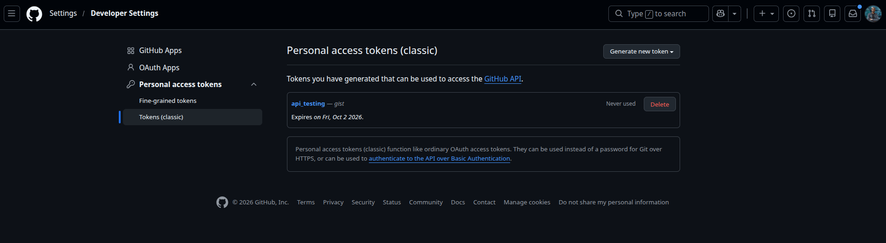
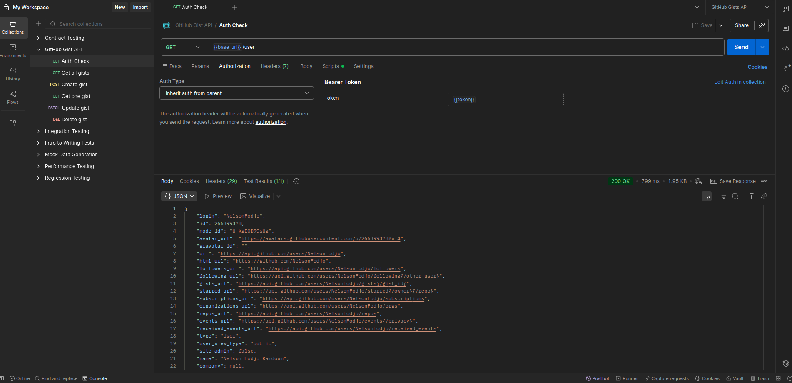
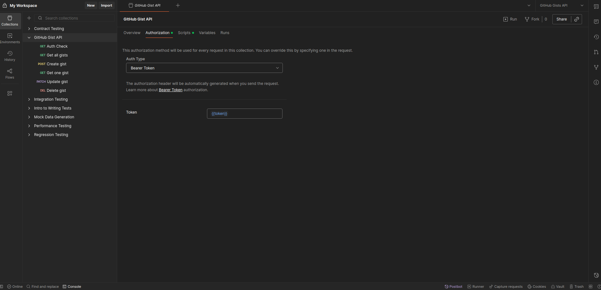
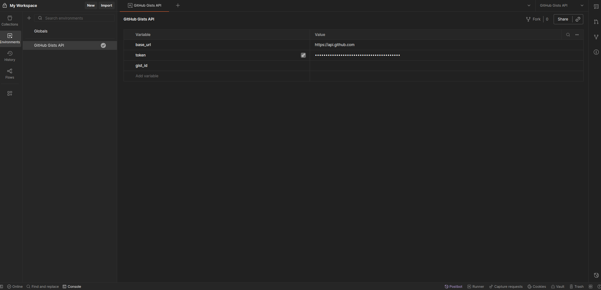

# Exploring and Testing APIs with Postman
## GitHub Gists API — Documentation

## 1. API Choice

**API:** GitHub Gists API \
**Base URL:** `https://api.github.com` \
**Official Docs:** `https://docs.github.com/en/rest/gists?apiVersion=2026-03-10`

GitHub Gists was chosen because it supports full CRUD operations (Create, Read, Update, Delete) on a simple resource (a "gist"), and uses a straightforward token-based authentication method suitable for testing in Postman.

---

## 2. Endpoint Exploration & Documentation

### Authentication / Login
GitHub's REST API does not expose a `/login` endpoint. Authentication is done by attaching a Personal Access Token (PAT) as a Bearer token in the `Authorization` header on every request.

| Field | Value |
|---|---|
| Method | N/A (no login endpoint) |
| Mechanism | Personal Access Token, generated manually in GitHub account settings |
| Header used on all requests | `Authorization: Bearer <token>` |

---

### Summary Table

| Operation | Method | URL | Headers | Body | Success Status |
|---|---|---|---|---|---|
| Auth check | GET | `/user` | Authorization | None | 200 |
| List gists | GET | `/gists` | Authorization | None | 200 |
| Get one gist | GET | `/gists/{gist_id}` | Authorization | None | 200 |
| Create gist | POST | `/gists` | Authorization, Content-Type | JSON | 201 |
| Update gist | PATCH | `/gists/{gist_id}` | Authorization, Content-Type | JSON | 200 |
| Delete gist | DELETE | `/gists/{gist_id}` | Authorization | None | 204 |

---

## 3. Authentication

**Method used:** Token-based authentication (Personal Access Token).

**Token generation:** Generated manually via GitHub → Settings → Developer settings → Personal access tokens → Tokens (classic), scoped to `gist`. GitHub does not issue tokens through an API call.



**Authentication request:** In place of a login endpoint, `GET /user` demonstrates that the token authenticates successfully.

| Field | Value |
|---|---|
| URL | `https://api.github.com/user` |
| Method | GET |
| Headers | `Authorization: Bearer <token>` |
| Successful response | 200 OK, JSON with `login`, `id`, `name`, etc. |

**Token/session received:** GitHub does not return a session object — the PAT is the standing credential. A 200 response from `/user` confirms it is valid.



**Token storage:**

| Component | Value |
|---|---|
| Environment variable | `token` (type: secret) |
| Collection-level Authorization | Type: Bearer Token, Token: `{{token}}` |
| Per-request Authorization | "Inherit auth from parent" |

Setting Bearer auth once at the collection level means every request automatically authenticates without repeating the token, satisfying the "store the token for subsequent requests" requirement of the brief.







---

## 4. CRUD Operations

### GET – Retrieve all gists
Request: `GET https://api.github.com/gists`, header `Authorization: Bearer {{token}}`


<screenshot> — GET /gists request and 200 response


### GET – Retrieve a specific gist
Request: `GET https://api.github.com/gists/{{gist_id}}`

Returns the same object shape with full file `content` included.

<screenshot> — GET /gists/{{gist_id}} request and 200 response


### POST – Create new gist
Request: `POST https://api.github.com/gists`, header `Content-Type: application/json`

Body:
```json
{
  "description": "Test gist from Postman assignment",
  "public": true,
  "files": {
    "test.md": {
      "content": "# Hello from Postman\nThis gist was created via the API."
    }
  }
}
```

Example response (201 Created):
```json
{
  "id": "aa5a315d61ae9438b18d",
  "description": "Test gist from Postman assignment",
  "public": true,
  "files": {
    "test.md": {
      "filename": "test.md",
      "content": "# Hello from Postman\nThis gist was created via the API."
    }
  },
  "html_url": "https://gist.github.com/username/aa5a315d61ae9438b18d",
  "created_at": "2026-09-05T10:12:00Z"
}
```

The returned `id` is captured into the `gist_id` environment variable for use in subsequent requests.

<screenshot> — POST /gists request, body, and 201 response

<screenshot> — Environment panel showing gist_id populated in Current Value after Create


### PATCH – Update existing gist
Request: `PATCH https://api.github.com/gists/{{gist_id}}`, header `Content-Type: application/json`

Body:
```json
{
  "description": "Updated via Postman - PATCH test",
  "files": {
    "test.md": {
      "content": "# Updated content\nThis was changed by a PATCH request."
    }
  }
}
```

Example response (200 OK):
```json
{
  "id": "aa5a315d61ae9438b18d",
  "description": "Updated via Postman - PATCH test",
  "files": {
    "test.md": {
      "filename": "test.md",
      "content": "# Updated content\nThis was changed by a PATCH request."
    }
  },
  "updated_at": "2026-09-05T10:20:00Z"
}
```

<screenshot> — PATCH request, body, and 200 response


### DELETE – Remove gist
Request: `DELETE https://api.github.com/gists/{{gist_id}}`

Response: `204 No Content`, empty body, confirming deletion.

<screenshot> — DELETE request and 204 response


---

## 5. Postman Environment & Variables

**Environment name:** GitHub Gists API

| Variable | Type | Purpose |
|---|---|---|
| `base_url` | default | `https://api.github.com` — root URL used across every request |
| `token` | secret | Personal Access Token used for Bearer authentication |
| `gist_id` | default | ID of the gist created during testing, reused by Get (single), Update, and Delete |

Every request references `{{base_url}}/gists` (or `{{base_url}}/gists/{{gist_id}}`) instead of hardcoded URLs, and inherits Bearer `{{token}}` from the collection level.

### Adapting the pre-request/token-refresh requirement
The brief's example assumes a username/password `/login` endpoint returning a refreshable token. GitHub PATs do not expire per-session and are not issued via a login endpoint, so this does not apply directly. Two script-based mechanisms were used instead to meet the spirit of the requirement:

**1. Token presence check (collection Pre-request Script):**
```javascript
if (!pm.environment.get("token")) {
    console.warn("No token set in environment — requests will fail with 401");
}
```

**2. Dynamic resource ID capture (Post-response script on Create Gist):**
```javascript
if (pm.response.code >= 400) {
    var errorData = pm.response.json();
    pm.test("Error: " + errorData.message, function () {
        pm.expect(errorData.message).to.exist;
    });
} else {
    var jsonData = pm.response.json();
    if (jsonData.id) {
        pm.environment.set("gist_id", jsonData.id);
    }
    pm.test("Gist Created Successfully with ID: " + jsonData.id, function () {
        pm.expect(jsonData.id).to.exist;
    });
}
```
This automatically writes the new gist's `id` into the environment, so later requests use `{{gist_id}}` without manual copy-pasting — functionally equivalent to the brief's `auth_token` capture example, applied to a resource ID instead of a token. It also folds in error handling: if the request fails, the test name itself reports GitHub's actual error message instead of asserting a generic pass/fail.

---

## 6. Automation / Testing

Every request follows the same pattern: on success, assert the expected result; on failure (status code ≥ 400, or 404 where relevant), report the actual error message from the API response as the test name — so error handling only activates when a real failure occurs, without needing separate dummy-error requests.

### Auth check (GET /user)
```javascript
if (pm.response.code !== 200) {
    var errorData = pm.response.json();
    pm.test("Error: " + errorData.message, function () {
        pm.expect(errorData.message).to.exist;
    });
} else {
    var jsonData = pm.response.json();
    pm.test("Authenticated successfully as " + jsonData.login, function () {
        pm.expect(jsonData.login).to.exist;
    });
}
```

### Get all gists (GET /gists)
```javascript
if (pm.response.code !== 200) {
    var errorData = pm.response.json();
    pm.test("Error: " + errorData.message, function () {
        pm.expect(errorData.message).to.exist;
    });
} else {
    var jsonData = pm.response.json();
    pm.test("Fetched " + jsonData.length + " gist(s) successfully", function () {
        pm.expect(jsonData).to.be.an("array");
    });
}
```

### Create gist (POST /gists)
```javascript
if (pm.response.code >= 400) {
    var errorData = pm.response.json();
    pm.test("Error: " + errorData.message, function () {
        pm.expect(errorData.message).to.exist;
    });
} else {
    var jsonData = pm.response.json();
    if (jsonData.id) {
        pm.environment.set("gist_id", jsonData.id);
    }
    pm.test("Gist Created Successfully with ID: " + jsonData.id, function () {
        pm.expect(jsonData.id).to.exist;
    });
}
```

### Get single gist (GET /gists/{{gist_id}})
```javascript
if (pm.response.code === 404) {
    var errorData = pm.response.json();
    pm.test("Error: " + errorData.message, function () {
        pm.expect(errorData.message).to.exist;
    });
} else {
    var jsonData = pm.response.json();
    var fileName = Object.keys(jsonData.files)[0];
    pm.test("Gist \"" + fileName + "\" retrieved successfully", function () {
        pm.response.to.have.status(200);
    });
}
```

### Update gist (PATCH /gists/{{gist_id}})
```javascript
if (pm.response.code >= 400) {
    var errorData = pm.response.json();
    pm.test("Error: " + errorData.message, function () {
        pm.expect(errorData.message).to.exist;
    });
} else {
    var jsonData = pm.response.json();
    pm.test("Gist updated successfully - new description: " + jsonData.description, function () {
        pm.expect(jsonData.description).to.eql("Updated via Postman - PATCH test");
    });
}
```

### Delete gist (DELETE /gists/{{gist_id}})
```javascript
if (pm.response.code === 404) {
    var errorData = pm.response.json();
    pm.test("Error: " + errorData.message, function () {
        pm.expect(errorData.message).to.exist;
    });
} else {
    pm.test("Gist with ID " + pm.environment.get("gist_id") + " deleted successfully", function () {
        pm.response.to.have.status(204);
    });
}
```

### Running via Collection Runner
1. Open Runner, select the collection and the **GitHub Gists API** environment
2. Request order: Auth check → Get all gists → Create gist → Get single gist → Update gist → Delete gist
3. Run — each request executes in sequence; `gist_id` set by Create is automatically reused by the requests after it
4. Runner summary displays pass/fail count per test assertion across all requests, with error messages visible directly in test names for any failed request

<screenshot> — Collection Runner execution summary showing pass/fail results

### Token refresh (optional requirement)
Not implemented. GitHub Personal Access Tokens are long-lived and do not require per-session refresh, unlike the username/password example in the brief. If a token expires or is revoked, the fix is manual regeneration in GitHub Settings and updating the environment variable — there is no programmatic refresh endpoint for PATs.

**Known limitation:** since Create must run before Get single/Update/Delete for `gist_id` to be populated, running Delete then re-running the same Runner pass without a fresh Create will leave `gist_id` pointing at an already-deleted resource — this is now handled gracefully by the conditional error blocks, which will report a 404 with GitHub's actual message instead of failing silently.

---

## 7. Deliverables Checklist

- [ ] Postman Collection JSON export (requests, environment, scripts)
- [ ] This documentation with screenshots of each request/response
- [ ] Collection Runner execution screenshot
- [ ] GitHub repository link containing all files
- [ ] Live demo covering authentication, CRUD, environment variables, and automation